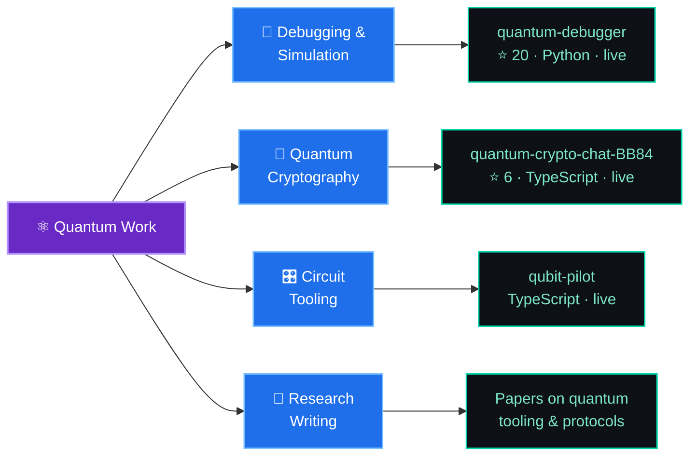

<!-- ────────────────────────────  HEADER  ──────────────────────────── -->


<div align="center">

<a href="https://github.com/Raunakg2005">
  
</a>

<br/>

[](https://github.com/Raunakg2005)
[](https://github.com/Raunakg2005?tab=followers)
[](https://github.com/Raunakg2005?tab=repositories)

<br/>

### ⚡ Jump to

<kbd>[🧠 About](#about)</kbd> &nbsp;
<kbd>[⚛️ Quantum](#quantum)</kbd> &nbsp;
<kbd>[🛠️ Tech Stack](#stack)</kbd> &nbsp;
<kbd>[🚀 Projects](#projects)</kbd> &nbsp;
<kbd>[📊 Stats](#stats)</kbd> &nbsp;
<kbd>[🤝 Connect](#connect)</kbd>

</div>

---

<!-- ────────────────────────────  ABOUT  ──────────────────────────── -->
<a id="about"></a>

## 🧠 About Me

```ts
const raunak = {
  role:        "Quantum Computing Engineer & Full Stack Developer",
  location:    "Mumbai, India 🇮🇳",
  shipping:    ["Quantum debugging tooling", "QKD-secured apps", "AI crime analytics"],
  writing:     "Quantum computing research papers",
  stack:       ["TypeScript", "Python", "Qiskit", "Next.js", "Solidity", "Flutter"],
  philosophy:  "Build it, run it, measure it — then write the paper.",
  openTo:      ["Quantum research collabs", "OSS", "Hard problems"],
} as const;
```

<details>
<summary><b>👉 A bit more (click to expand)</b></summary>

<br/>

|  | |
|---|---|
| ⚛️ | **Quantum is my main line of work**, not a side interest — I build debugging tooling, QKD protocol implementations, and circuit-simulation platforms, and I write research on them. |
| 🤖 | I build **AI/ML systems that get deployed** — geospatial crime analytics, NLP pipelines, and LLM-backed products. |
| ⛓️ | I write **Solidity smart contracts** and ship DApps with real Web3 integration. |
| 🧩 | Full stack across **Next.js, FastAPI, Flutter, SwiftUI** — web, mobile, and everything wiring them together. |
| 🎯 | I care about the boring parts: tests, CI, Docker, and code someone else can read. |
| 📫 | Open to collaboration — **[raunakg2005@gmail.com](mailto:raunakg2005@gmail.com)** |

</details>

---

<!-- ────────────────────────────  QUANTUM  ──────────────────────────── -->
<a id="quantum"></a>

## ⚛️ Quantum Computing — What I've Built

> Not "currently exploring." Shipped, deployed, and publicly usable.



<div align="center">

<a href="https://github.com/Raunakg2005/quantum-debugger">
  
</a>
<a href="https://github.com/Raunakg2005/quantum-crypto-chat-BB84">
  
</a>
<a href="https://github.com/Raunakg2005/qubit-pilot">
  
</a>
<a href="https://github.com/Raunakg2005/QuantumS-hack">
  
</a>

</div>

<details>
<summary><b>⚛️ What each one actually does (click to expand)</b></summary>

<br/>

### 🐛 [quantum-debugger](https://github.com/Raunakg2005/quantum-debugger) &nbsp; `⭐ 20`
Debugging and inspection tooling for quantum circuits — step through a circuit, inspect intermediate state, and find where your algorithm actually breaks.
> 🔗 **Live:** [quantum-debugger.vercel.app](https://quantum-debugger.vercel.app) &nbsp;·&nbsp; 🐍 Python

### 🔐 [quantum-crypto-chat-BB84](https://github.com/Raunakg2005/quantum-crypto-chat-BB84) &nbsp; `⭐ 6`
A chat app secured by the **BB84 quantum key distribution protocol** — key exchange, eavesdropper detection, and real-time encrypted messaging.
> 🔗 **Live:** [quantum-crypto-chat-bb-84.vercel.app](https://quantum-crypto-chat-bb-84.vercel.app) &nbsp;·&nbsp; 🟦 Next.js + TypeScript

### 🎛️ [qubit-pilot](https://github.com/Raunakg2005/qubit-pilot)
A quantum circuit workbench — build, run, and visualise circuits from the browser.
> 🔗 **Live:** [qpilot.quantyxio.cloud](https://qpilot.quantyxio.cloud/) &nbsp;·&nbsp; 🟦 TypeScript

### 🧪 [QuantumS-hack](https://github.com/Raunakg2005/QuantumS-hack)
Quantum hackathon build — rapid prototyping on quantum primitives.
> 🟦 TypeScript

</details>

---

<!-- ────────────────────────────  TECH STACK  ──────────────────────────── -->
<a id="stack"></a>

## 🛠️ Tech Stack

<div align="center">


<br/>

<br/>


</div>

<br/>

<details>
<summary><b>⚛️ Quantum & Scientific Computing</b></summary>
<br/>


</details>

<details>
<summary><b>🎨 Frontend & Mobile</b></summary>
<br/>


</details>

<details>
<summary><b>⚙️ Backend, Data & DevOps</b></summary>
<br/>


</details>

<details>
<summary><b>🤖 AI/ML & 🔗 Web3</b></summary>
<br/>


</details>

---

<!-- ────────────────────────────  PROJECTS  ──────────────────────────── -->
<a id="projects"></a>

## 🚀 Featured Projects

<div align="center">

<a href="https://github.com/Raunakg2005/astra-crime-intelligence">
  
</a>
<a href="https://github.com/Raunakg2005/F-Shield">
  
</a>
<a href="https://github.com/Raunakg2005/Savaaree-Ride-App">
  
</a>
<a href="https://github.com/Raunakg2005/ResoRoute">
  
</a>

</div>

<details open>
<summary><b>📋 Project index — the short version</b></summary>

<br/>

| Project | What it is | Stack | Live |
|---|---|---|---|
| ⚛️ **[quantum-debugger](https://github.com/Raunakg2005/quantum-debugger)** `⭐20` | Debugging & inspection for quantum circuits | `Python` `Qiskit` | [↗](https://quantum-debugger.vercel.app) |
| 🔐 **[quantum-crypto-chat-BB84](https://github.com/Raunakg2005/quantum-crypto-chat-BB84)** `⭐6` | Chat secured by BB84 quantum key distribution | `Next.js` `TypeScript` | [↗](https://quantum-crypto-chat-bb-84.vercel.app) |
| 🎛️ **[qubit-pilot](https://github.com/Raunakg2005/qubit-pilot)** | Browser-based quantum circuit workbench | `TypeScript` | [↗](https://qpilot.quantyxio.cloud/) |
| 🛰️ **[astra-crime-intelligence](https://github.com/Raunakg2005/astra-crime-intelligence)** | AI crime analytics for Karnataka State Police — geospatial hotspots, criminal-network link analysis, predictive + NLP ML | `Python` `ML` `Zoho Catalyst` | — |
| 🛡️ **[F-Shield](https://github.com/Raunakg2005/F-Shield)** | Fraud/threat detection platform | `TypeScript` | [↗](https://f-shield.vercel.app) |
| 🚗 **[Savaaree](https://github.com/Raunakg2005/Savaaree-Ride-App)** | Blockchain ride-sharing DApp with smart-contract settlement | `Node.js` `Web3.js` `Solidity` | — |
| 🗺️ **[ResoRoute](https://github.com/Raunakg2005/ResoRoute)** | Routing & resource-navigation app | `Flutter` `Dart` | [↗](https://reso-route.vercel.app) |
| 💊 **[choices-anti-drug](https://github.com/Raunakg2005/choices-anti-drug-vite)** | Drug-awareness platform with a Gemini-powered chatbot & forum | `Vite` `React` `Node` `MongoDB` | — |
| 📱 **[Campus Connect](https://github.com/Raunakg2005/ios-exp-2)** | SwiftUI college companion app | `Swift` `SwiftUI` | — |

</details>

---

<!-- ────────────────────────────  STATS  ──────────────────────────── -->
<a id="stats"></a>

## 📊 By the Numbers

<div align="center">


<br/><br/>


</div>

<details>
<summary><b>📈 Contribution activity graph</b></summary>

<br/>
<div align="center">


</div>
</details>

<details>
<summary><b>🏆 Trophy cabinet</b></summary>

<br/>
<div align="center">


</div>
</details>

---

## 🐍 Watch the Snake Eat My Commits

<div align="center">

<picture>
  <source media="(prefers-color-scheme: dark)" srcset="https://raw.githubusercontent.com/Raunakg2005/Raunakg2005/output/github-contribution-grid-snake-dark.svg" />
  <source media="(prefers-color-scheme: light)" srcset="https://raw.githubusercontent.com/Raunakg2005/Raunakg2005/output/github-contribution-grid-snake.svg" />
  
</picture>

</div>

---

<!-- ────────────────────────────  CONNECT  ──────────────────────────── -->
<a id="connect"></a>

## 🤝 Connect

<div align="center">

<a href="https://www.linkedin.com/in/raunak-kumar-gupta-7b3503270">
  
</a>
<a href="mailto:raunakg2005@gmail.com">
  
</a>
<a href="https://github.com/Raunakg2005">
  
</a>

<br/><br/>

**Got a quantum problem, a gnarly ML pipeline, or a contract that needs auditing? Let's talk.**

<br/>


</div>

<!-- ────────────────────────────  FOOTER  ──────────────────────────── -->


