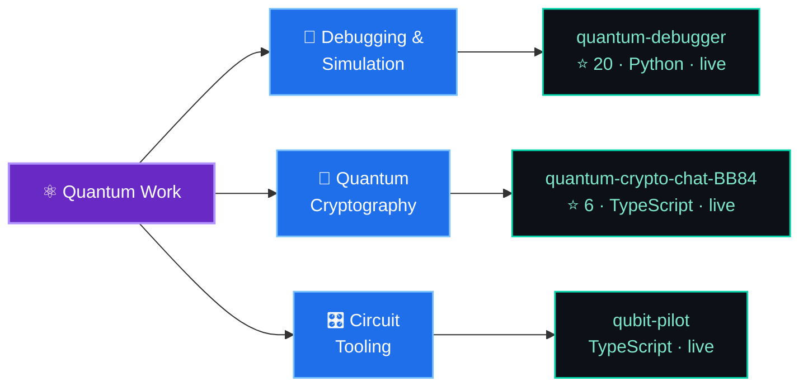

<!-- ══════════════════════════════  HERO  ══════════════════════════════ -->

 

 

### ⚡ Jump to

<kbd>[🧠 About](#about)</kbd> &nbsp;
<kbd>[🛠️ Stack](#stack)</kbd> &nbsp;
<kbd>[⚛️ Quantum](#quantum)</kbd> &nbsp;
<kbd>[📱 Apps & XR](#apps)</kbd> &nbsp;
<kbd>[🚀 Projects](#projects)</kbd> &nbsp;
<kbd>[📊 Stats](#stats)</kbd> &nbsp;
<kbd>[🤝 Connect](#connect)</kbd>

---

<!-- ══════════════════════════════  ABOUT  ══════════════════════════════ -->

<b>👉 A bit more (click to expand)</b>

 

---

<!-- ══════════════════════════════  STACK  ══════════════════════════════ -->

**Languages**

**Frontend**

**App · Mobile · XR**

**Backend**

**AI / ML · Data**

**Databases**

**DevOps · Cloud · Tools**

 

<b>⚛️ Quantum &amp; scientific computing</b>

 

<b>📱 App development — native &amp; cross-platform</b>

 

<b>🎮 AR / VR / Game development</b>

 

<b>⚙️ DevOps &amp; MLOps</b>

 

**CI / CD &amp; infrastructure**

**Observability**

**MLOps — training to production**

**Hands-on labs:** [devops-exp-2](https://github.com/Raunakg2005/devops-exp-2) — a sample app built and tested by a Jenkins CI pipeline &nbsp;·&nbsp; [devops-exp-1](https://github.com/Raunakg2005/devops-exp-1) — every command from the official git cheat sheet, documented with real output.

<b>🤖 AI / ML &amp; 🔗 Web3</b>

 

---

<!-- ══════════════════════════════  QUANTUM  ══════════════════════════════ -->

---

<!-- ══════════════════════════════  APPS & XR  ══════════════════════════════ -->

<b>📱 More app &amp; XR builds</b>

 

---

<!-- ══════════════════════════════  PROJECTS  ══════════════════════════════ -->

  

---

<!-- ══════════════════════════════  STATS  ══════════════════════════════ -->

  

---

<!-- ══════════════════════════════  SNAKE  ══════════════════════════════ -->

<picture>
  <source media="(prefers-color-scheme: dark)" srcset="https://raw.githubusercontent.com/Raunakg2005/Raunakg2005/output/github-contribution-grid-snake-dark.svg" />
  <source media="(prefers-color-scheme: light)" srcset="https://raw.githubusercontent.com/Raunakg2005/Raunakg2005/output/github-contribution-grid-snake.svg" />
  
</picture>

---

<!-- ══════════════════════════════  CONNECT  ══════════════════════════════ -->

  

**Got a quantum problem, an app to build, a gnarly ML pipeline, or a contract that needs auditing? Let's talk.**

 

