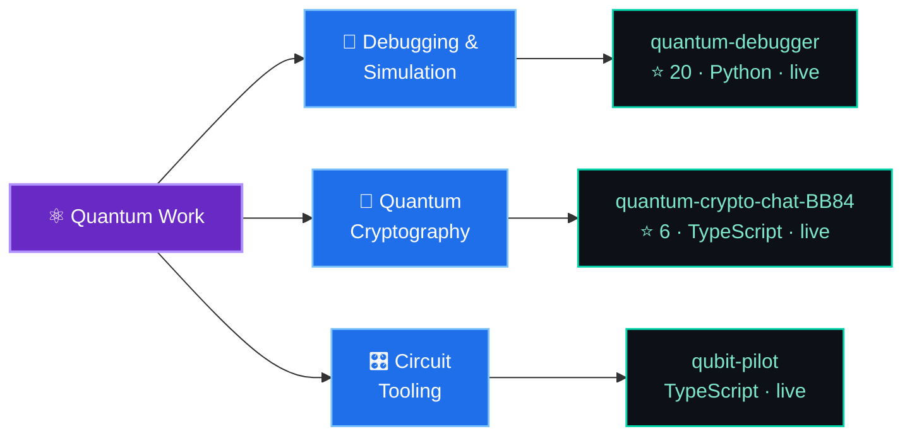

<!-- ══════════════════════════════  HERO  ══════════════════════════════ -->

<div align="center">


<br/>

<a href="https://github.com/Raunakg2005">
  
</a>

<br/>

[](https://github.com/Raunakg2005)
[](https://github.com/Raunakg2005?tab=followers)
[](https://github.com/Raunakg2005?tab=repositories)

### ⚡ Jump to

<kbd>[🧠 About](#about)</kbd> &nbsp;
<kbd>[🛠️ Stack](#stack)</kbd> &nbsp;
<kbd>[⚛️ Quantum](#quantum)</kbd> &nbsp;
<kbd>[📱 Apps & XR](#apps)</kbd> &nbsp;
<kbd>[🚀 Projects](#projects)</kbd> &nbsp;
<kbd>[📊 Stats](#stats)</kbd> &nbsp;
<kbd>[🤝 Connect](#connect)</kbd>

</div>

---

<!-- ══════════════════════════════  ABOUT  ══════════════════════════════ -->
<a id="about"></a>

## 🧠 About Me

```ts
const raunak = {
  role:       "Full Stack · App · AI/ML · Web3 · Quantum",
  location:   "Mumbai, India 🇮🇳",
  building:   ["Quantum tooling", "Cross-platform apps", "AI platforms", "DApps", "XR experiences"],
  languages:  30,        // shipped across 54 public repos
  stack:      ["TypeScript", "Python", "Flutter", "Swift", "Solidity", "Qiskit", "Unity"],
  philosophy: "Build it, run it, measure it — then ship it.",
  openTo:     ["Collabs", "OSS", "Hard problems"],
} as const;
```

<details>
<summary><b>👉 A bit more (click to expand)</b></summary>

<br/>

|  | |
|---|---|
| 🧩 | **Full stack, genuinely end to end** — Next.js and React on the front, Node/FastAPI/Laravel behind it, Postgres or Mongo underneath, Dockerised and deployed. |
| 📱 | **App developer** across **Flutter, SwiftUI, and Kotlin** — native iOS, native Android, and cross-platform, shipped to real devices. |
| ⚛️ | **Quantum is shipped work, not a hobby** — debugging tooling, QKD protocol implementations, and circuit simulators that are live on the web right now. |
| 🤖 | **AI/ML that gets deployed** — geospatial crime analytics, NLP pipelines, fraud detection, and LLM-backed products. |
| ⛓️ | **Solidity smart contracts** and DApps with real Web3 integration. |
| 🎮 | **AR / VR / game dev in Unity** — C#, custom HLSL and ShaderLab shaders, and a handful of VR builds. |
| 🎯 | I care about the boring parts: tests, CI, Docker, and code someone else can read. |
| 📫 | Open to collaboration — **[raunakg2005@gmail.com](mailto:raunakg2005@gmail.com)** |

</details>

---

<!-- ══════════════════════════════  STACK  ══════════════════════════════ -->
<a id="stack"></a>

## 🛠️ Tech Stack

<div align="center">

**Languages**


**Frontend**


**App · Mobile · XR**


**Backend**


**AI / ML · Data**


**Databases**


**DevOps · Cloud · Tools**


</div>

<br/>

<details>
<summary><b>⚛️ Quantum &amp; scientific computing</b></summary>
<br/>


</details>

<details>
<summary><b>📱 App development — native &amp; cross-platform</b></summary>
<br/>


</details>

<details>
<summary><b>🎮 AR / VR / Game development</b></summary>
<br/>


</details>

<details>
<summary><b>🤖 AI / ML &amp; 🔗 Web3</b></summary>
<br/>


</details>

---

<!-- ══════════════════════════════  QUANTUM  ══════════════════════════════ -->
<a id="quantum"></a>

## ⚛️ Quantum Computing — What I've Built

> Not "currently exploring." Shipped, deployed, and publicly usable.



<table>
<tr>
<td width="50%" valign="top">

### 🐛 [quantum-debugger](https://github.com/Raunakg2005/quantum-debugger)

[](https://github.com/Raunakg2005/quantum-debugger/stargazers)
[](https://github.com/Raunakg2005/quantum-debugger)
[](https://quantum-debugger.vercel.app)

Debugging and inspection tooling for quantum circuits — step through a circuit, inspect intermediate state, and find where the algorithm actually breaks.

</td>
<td width="50%" valign="top">

### 🔐 [quantum-crypto-chat-BB84](https://github.com/Raunakg2005/quantum-crypto-chat-BB84)

[](https://github.com/Raunakg2005/quantum-crypto-chat-BB84/stargazers)
[](https://github.com/Raunakg2005/quantum-crypto-chat-BB84)
[](https://quantum-crypto-chat-bb-84.vercel.app)

Chat secured by the **BB84 quantum key distribution protocol** — key exchange, eavesdropper detection, and real-time encrypted messaging.

</td>
</tr>
<tr>
<td width="50%" valign="top">

### 🎛️ [qubit-pilot](https://github.com/Raunakg2005/qubit-pilot)

[](https://github.com/Raunakg2005/qubit-pilot)
[](https://qpilot.quantyxio.cloud/)

A quantum circuit workbench — build, run, and visualise circuits straight from the browser.

</td>
<td width="50%" valign="top">

### 🧪 [QuantumS-hack](https://github.com/Raunakg2005/QuantumS-hack)

[](https://github.com/Raunakg2005/QuantumS-hack)
[](https://github.com/Raunakg2005/QuantumS-hack)

Quantum hackathon build — rapid prototyping on quantum primitives under a deadline.

</td>
</tr>
</table>

---

<!-- ══════════════════════════════  APPS & XR  ══════════════════════════════ -->
<a id="apps"></a>

## 📱 App Development · AR / VR

<table>
<tr>
<td width="50%" valign="top">

### 🗺️ [ResoRoute](https://github.com/Raunakg2005/ResoRoute)

[](https://github.com/Raunakg2005/ResoRoute)
[](https://reso-route.vercel.app)

Cross-platform routing and resource-navigation app built in Flutter.

</td>
<td width="50%" valign="top">

### 🎓 [Campus Connect](https://github.com/Raunakg2005/ios-exp-2)

[](https://github.com/Raunakg2005/ios-exp-2)
[](https://github.com/Raunakg2005/ios-exp-2)

Native SwiftUI college companion app — a full iOS build, not a wrapper.

</td>
</tr>
<tr>
<td width="50%" valign="top">

### 🥽 [VR Shooting Gallery](https://github.com/Raunakg2005/VR_Shooting_Gallery)

[](https://github.com/Raunakg2005/VR_Shooting_Gallery)
[](https://github.com/Raunakg2005/VR_Shooting_Gallery)

Room-scale VR shooting range built in Unity with custom shaders.

</td>
<td width="50%" valign="top">

### 🧪 [Chem AR](https://github.com/Raunakg2005/chem-ar)

[](https://github.com/Raunakg2005/chem-ar)
[](https://github.com/Raunakg2005/chem-ar)

Augmented-reality chemistry visualiser — molecules rendered into the real world.

</td>
</tr>
</table>

<details>
<summary><b>📱 More app &amp; XR builds</b></summary>

<br/>

| Project | What it is | Stack |
|---|---|---|
| 🎮 **[Block Blast](https://github.com/Raunakg2005/Block-Blast)** | Puzzle game build | `TypeScript` |
| 🥁 **[VR Beat Box](https://github.com/Raunakg2005/VR-beat-box)** | Rhythm experience in VR | `C++` `Unity` |
| 🔢 **[2048 iOS](https://github.com/Raunakg2005/2048-ios-game)** | Native iOS take on 2048 | `Swift` |
| 🔊 **[echoscape](https://github.com/Raunakg2005/echoscape.swiftpm)** | Swift Playgrounds audio app | `Swift` |
| 📷 **[AtomicQR (iOS + Android)](https://github.com/Raunakg2005/AtomicQR-IOS-Compound)** | AR chemistry QR compound viewer | `C#` `Unity` |
| 📅 **[Faculty Timetable](https://github.com/Raunakg2005/Faculty_Timetable_Build)** | Timetable builder app | `Dart` `Flutter` |

</details>

---

<!-- ══════════════════════════════  PROJECTS  ══════════════════════════════ -->
<a id="projects"></a>

## 🚀 Featured Projects

<table>
<tr>
<td width="50%" valign="top">

### 🛰️ [astra-crime-intelligence](https://github.com/Raunakg2005/astra-crime-intelligence)

[](https://github.com/Raunakg2005/astra-crime-intelligence)
[](https://github.com/Raunakg2005/astra-crime-intelligence)
[](https://github.com/Raunakg2005/astra-crime-intelligence)

AI-driven crime analytics for the **Karnataka State Police** — geospatial hotspots, criminal-network link analysis, and predictive + NLP models.

</td>
<td width="50%" valign="top">

### 🛡️ [F-Shield](https://github.com/Raunakg2005/F-Shield)

[](https://github.com/Raunakg2005/F-Shield)
[](https://f-shield.vercel.app)

Fraud and threat detection platform with a live dashboard.

</td>
</tr>
<tr>
<td width="50%" valign="top">

### 🚗 [Savaaree](https://github.com/Raunakg2005/Savaaree-Ride-App)

[](https://github.com/Raunakg2005/Savaaree-Ride-App)
[](https://github.com/Raunakg2005/Savaaree-Ride-App)

Blockchain ride-sharing DApp — smart-contract settlement and real-time matching.

</td>
<td width="50%" valign="top">

### 💊 [choices-anti-drug](https://github.com/Raunakg2005/choices-anti-drug-vite)

[](https://github.com/Raunakg2005/choices-anti-drug-vite)
[](https://github.com/Raunakg2005/choices-anti-drug-vite)

Drug-awareness platform with a Gemini-powered chatbot, forum, and auth.

</td>
</tr>
</table>

<details open>
<summary><b>📋 Full project index</b></summary>

<br/>

| Project | Domain | Stack | Live |
|---|---|---|---|
| **[quantum-debugger](https://github.com/Raunakg2005/quantum-debugger)** `⭐20` | ⚛️ Quantum | `Python` `Qiskit` | [↗](https://quantum-debugger.vercel.app) |
| **[quantum-crypto-chat-BB84](https://github.com/Raunakg2005/quantum-crypto-chat-BB84)** `⭐6` | ⚛️ Quantum crypto | `Next.js` `TypeScript` | [↗](https://quantum-crypto-chat-bb-84.vercel.app) |
| **[qubit-pilot](https://github.com/Raunakg2005/qubit-pilot)** | ⚛️ Quantum tooling | `TypeScript` | [↗](https://qpilot.quantyxio.cloud/) |
| **[astra-crime-intelligence](https://github.com/Raunakg2005/astra-crime-intelligence)** | 🤖 AI/ML | `Python` `ML` `NLP` | — |
| **[F-Shield](https://github.com/Raunakg2005/F-Shield)** | 🛡️ Security | `TypeScript` | [↗](https://f-shield.vercel.app) |
| **[Savaaree](https://github.com/Raunakg2005/Savaaree-Ride-App)** | ⛓️ Web3 | `Node` `Web3.js` `Solidity` | — |
| **[ResoRoute](https://github.com/Raunakg2005/ResoRoute)** | 📱 App | `Flutter` `Dart` | [↗](https://reso-route.vercel.app) |
| **[Campus Connect](https://github.com/Raunakg2005/ios-exp-2)** | 📱 iOS | `Swift` `SwiftUI` | — |
| **[VR Shooting Gallery](https://github.com/Raunakg2005/VR_Shooting_Gallery)** | 🥽 XR | `Unity` `C#` | — |
| **[chem-ar](https://github.com/Raunakg2005/chem-ar)** | 🥽 AR | `Unity` `C#` | — |
| **[choices-anti-drug](https://github.com/Raunakg2005/choices-anti-drug-vite)** | 🤖 AI product | `Vite` `React` `MongoDB` | — |
| **[Novadiff](https://github.com/Raunakg2005/Novadiff-jac)** | 🧬 Experimental | `Jac` | — |

</details>

---

<!-- ══════════════════════════════  STATS  ══════════════════════════════ -->
<a id="stats"></a>

## 📊 By the Numbers

<div align="center">


</div>

> Both cards are generated straight from the GitHub API by [a workflow in this repo](.github/workflows/build-assets.yml) and committed as static SVGs — no shared third-party instance to run out of API quota, and nothing for GitHub's image proxy to time out on.

<details open>
<summary><b>📈 Contribution activity</b></summary>

<br/>
<div align="center">


</div>
</details>

---

## 🐍 Watch the Snake Eat My Commits

<div align="center">

<picture>
  <source media="(prefers-color-scheme: dark)" srcset="https://raw.githubusercontent.com/Raunakg2005/Raunakg2005/output/github-contribution-grid-snake-dark.svg" />
  <source media="(prefers-color-scheme: light)" srcset="https://raw.githubusercontent.com/Raunakg2005/Raunakg2005/output/github-contribution-grid-snake.svg" />
  
</picture>

</div>

---

<!-- ══════════════════════════════  CONNECT  ══════════════════════════════ -->
<a id="connect"></a>

## 🤝 Connect

<div align="center">

<a href="https://www.linkedin.com/in/raunak-kumar-gupta-7b3503270">
  
</a>
<a href="mailto:raunakg2005@gmail.com">
  
</a>
<a href="https://github.com/Raunakg2005">
  
</a>

<br/><br/>

**Got a quantum problem, an app to build, a gnarly ML pipeline, or a contract that needs auditing? Let's talk.**

<br/>


</div>


